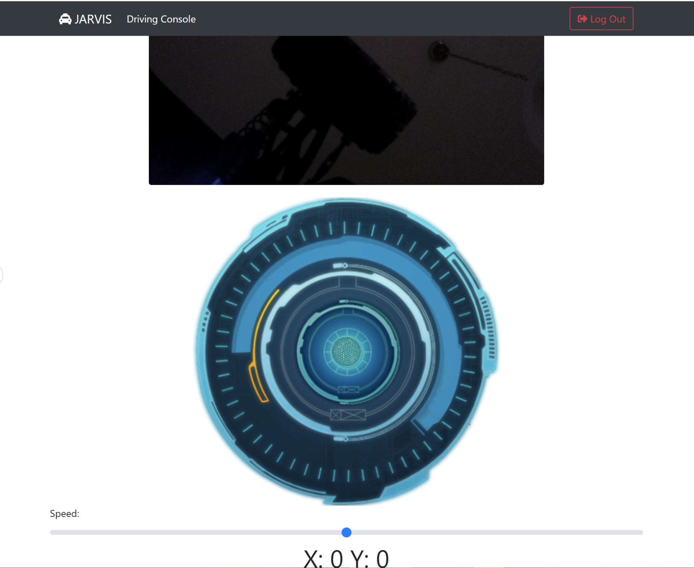

# jarvis - browser controlled vehicle with video stream



## Deps
```pip3 install flask```

```pip3 install websockets```

```pip3 install gunicorn```


## To start the websocket on port 8765

```sh
python3 sockets.py
```

## create IP.sh with home directory with env vars of IP and CAMERA
- IP should be your external IP (necessary for websockets)
- CAMERA should be pi or opencv
- There env vars are read by flask webapp
- IP when empty defaults to localhost for websocket IP
- CAMERA when empty defauts to showing sequence of 3 images instead of video stream

```sh
export IP=0.0.0.0
export CAMERA=pi

```

## To start the Flask server on port 3000:

```sh
gunicorn --threads 5 --workers 1 --bind 0.0.0.0:3000 webserver:app
```

## To Run

browser to http://localhost:3000

## Features

- Runs on RPi
- Flask web app with real time video steaming with MJPEG
- Websockets to arduino I2C bus controlling motors
- jQuery, Backbone
- Bootstrap CSS library
- CI/CD shell script managed by systemd service to restart flask app and websockets when push to master branch

# created by MenkeTechnologies
